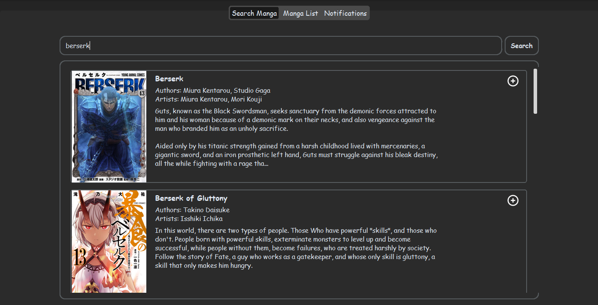
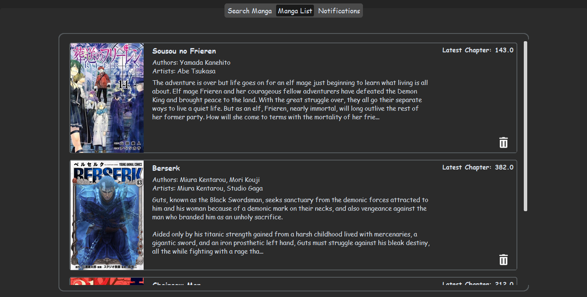
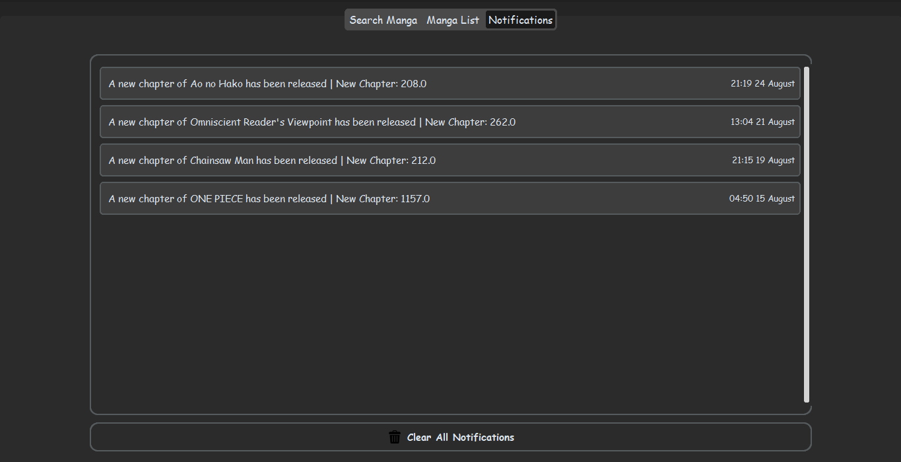

> [!NOTE]
> This application currently only works on **Windows**.

### *Never Miss Another Chapter Release!* 🔔

<div align="center">


[](https://github.com/asmrokon/Manga-Notifier/stargazers)
[](https://github.com/asmrokon/Manga-Notifier/network/members)
[](https://github.com/asmrokon/Manga-Notifier/issues)

*The ultimate desktop companion for casual manga readers who want to stay effortlessly updated with their favorite series!*

[📸 **Screenshots**](#-screenshots) • [📖 **Documentation**](#️-installation) • [🐛 **Report Bug**](https://github.com/asmrokon/Manga-Notifier/issues) • [✨ **Request Feature**](https://github.com/asmrokon/Manga-Notifier/issues)

</div>

---

## ✨ Features

- 📋 Add manga by searching directly in the app 
- 🗑️ Remove manga from your watchlist
- 🔔 Get notifications for new chapters (almost instantly)
- 🖥️ Clean desktop UI built with CustomTkinter
- ⚠️ Smart error handling for invalid/duplicate entries
- 📚 Track multiple manga simultaneously
- ⚡ Lightweight background monitoring


## 📸 Screenshots

### Search Manga Example


### Manga List Example


### Notification Example  


---

## 🚀 Getting Started

### ⚙️ **Installation**

#### **Option 1: Download Release (Recommended)**

1. Go to [Releases](https://github.com/asmrokon/Manga-Notifier/releases)
2. Download the latest `Manga-Notifier.zip`
3. Extract the zip file to your desired location
4. Create a desktop shortcut to `Manga-Notifier.exe`
5. Double-click the shortcut to run!

#### **Option 2: Build from Source**

Before you begin, ensure you have the following installed:
- 🐍 **Python** (v3.13 or higher)
- 🐙 **Git**

1. Clone the repository
```bash
git clone https://github.com/asmrokon/Manga-Notifier.git
cd Manga-Notifier
```

2. Install dependencies
```bash
pip install -r requirements.txt
```

3. Run the app
```bash
python main.py
```

### 🔄 Updates

To update the app:
1. Download the latest `Manga-Notifier.zip` from [Releases](https://github.com/asmrokon/Manga-Notifier/releases)
2. Replace only the `Manga-Notifier.exe` file in your installation folder
3. Your settings and manga list will be preserved

---

## 🎮 **Usage**

### 📚 **Adding Manga**

1. 🔍 **Search in App**: Type the manga name in the app’s search bar
2. 📋 **Select Manga**: Choose the correct manga from the search results
3. ➕ **Add to Watchlist**: Click the **plus icon** at the top-right corner to start tracking
4. 🔔 **Get Notified**: Receive Windows notifications for new chapter releases!

### 🗑️ **Managing Your Watchlist**

- **View All**: See all your tracked manga in the desktop interface
- **Remove**: Select and remove manga from your watchlist
- **Background Monitoring**: The app runs quietly in the background
- **Error Prevention**: Duplicate and invalid entries are automatically handled

---


## 🤝 **Contributing**

We love contributions! Here's how you can help make Manga Notifier even better:

### 🐛 **Bug Reports**
Found a bug? Please create an issue with:
- 📝 Clear description of the problem
- 🔄 Steps to reproduce
- 💻 Your environment details

### ✨ **Feature Requests**
Have a cool idea? We'd love to hear it! Open an issue with:
- 🎯 Clear description of the feature
- 💡 Why it would be useful
- 🖼️ Mockups or examples (if applicable)

### 👨‍💻 **Pull Requests**
Ready to contribute code?

1. 🍴 Fork the repository
2. 🌿 Create a feature branch (`git checkout -b amazing-feature`)
3. 💻 Make your changes
4. ✅ Test thoroughly
5. 📝 Commit your changes (`git commit -m 'Add amazing feature'`)
6. 🚀 Push to branch (`git push origin amazing-feature`)
7. 🎉 Open a Pull Request

---

## 📜 **License**

This project is licensed under the **MIT License** - see the [LICENSE](LICENSE) file for details.

---

## 🙏 **Acknowledgments**

- 🌟 [**Mangadex**](https://mangadex.org/) for their comprehensive manga database 
- 🎨 [**Icons8**](https://icons8.com/) for amazing visual assets
- ☕ **Coffee** for powering coding sessions

---

## 📞 **Contact & Support**

<div align="center">

### 👨‍💻 **Developer**
**ASM Rokon**

[](https://github.com/asmrokon)
[](#)
[](mailto:rokoncodes@gmail.com)


</div>

---

<div align="center">

### ⭐ **If you found this project helpful, please give it a star!** ⭐


**Made with ❤️ for manga readers everywhere** 🌍

</div>

---

## 🗺️ **Roadmap**

- [ ] 🌐 **Cross-Platform**: Support for macOS and Linux
- [ ] 📱 **Mobile Companion**: Mobile app for on-the-go management
- [ ] 🔔 **Notification Customization**: Custom notification sounds and styles
- [ ] 🎨 **Themes**: Multiple UI themes and customization options
- [ ] ⚙️ **Advanced Settings**: Configurable polling intervals and preferences

---

*Keep reading, keep growing!* 📚✨